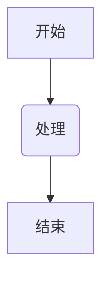

# 标题 1
## 标题 2
### 标题 3
#### 标题 4
##### 标题 5
<!--这是一段被注释的文字-->
###### 标题 6 <!--不存在标题7-->

## 文本

普通文本

**段落粗体文本**

*段落斜体文本*

***粗斜体***

___粗斜体___

==高亮== <!--VSCODE默认不支持-->

<mark>高亮</mark>

***==粗体+高亮+斜体==***

**无序列表**
- 列表项1
- 列表项2
  - 列表项2.1（Tab缩进实现嵌套）
  - 列表项2.2
- 列表项3（Shift+Tab取消缩进）

**有序列表**
1. 列表项a
2. 列表项b
   1. 列表项b1
   2. 列表项b2
3. 列表项c

**任务列表**

- [ ] 任务1
- [ ] 任务2
  - [ ] 嵌套任务2.1
  - [ ] 嵌套任务2.2
- [ ] 任务3       
<br> <!--换行-->
- [ ] 未完成任务
- [x] 已完成任务

引用语法：
>引用了一段名人名言
>>嵌套引用
>>>多层嵌套

强制换行：

这是第一行文字<!--末尾添加两个或多个空格，再回车，即可创建一个换行(<br>)-->  
第二行

或者直接使用\<br><!--HTML语法--><!--特殊符号前加'\'可直接显示而不是解析-->

分割线：

---

## 链接

[普通链接](http://www.bing.com/)

直接连接：<https://github.com>

[锚点连接](锚点名称123)

[锚点名称123]:http://www.pornhub.com/

## 脚注

1. 要添加脚注的话[^01]
2. 第二句要添加脚注的话[^02]

[^01]:脚注内容一
[^02]:脚注内容二
<!--脚注会显示在全文末尾-->

## 图片


<!--,title是可选的-->
<!--网络上的连接或者本地绝对路径-->

## 链接图片

[](https://pica.zhimg.com/v2-273e33ce6624ab89e4ed9e932bc75736_1440w.jpg)
<!--链接图片-->

## 表格

| 表头1 | 表头2 |
| ----- | ----- |
| 单元格1 | 单元格2 |
| 单元格3 | 单元格4 |

|左对齐|居中对齐|右对齐|
|:---|:-----:|---:|
|AAA|BBB|CCC|
<!--分割行至少三个减号-->

---

## 代码

**行内代码**
变量`myvar`被设置为值`100`
<!--此处'`'仅英文-->

**代码块**

```python
import numpy as np
def calc(a)
    return np.sqrt(a)*3

test = calc(12)
```

Mermaid代码：


**代码块嵌套**

````markdown
这是一篇python学习的知识笔记
下面是python样例代码
```dataview
import numpy as np
```

python从入门到精通
````


    

